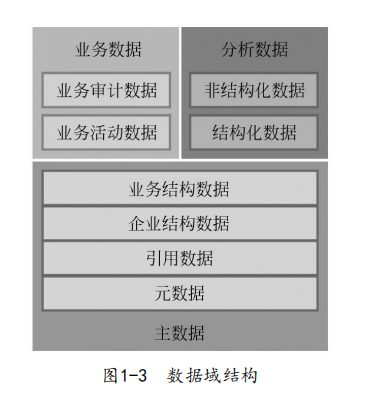

## 主数据

### 数据治理

价值:


#### 数据资产与数据管理

数据是一种未经加工的原始资料，是对客观事物的逻辑归纳，用 符号、字母等方式对客观事物进行直观描述。
信息资产是由企业**拥有或者控制**，**能够为企业带来未来经济利益**的**信息资源**。    
信息资产包括各种以物理或电子方式记录的数据、软件、服务、人员和其他类 别等。由于数据是信息在企业中的主要表达形式，因此，数据
资产成为信息资产中最重要的组成部分。

- 数据价值:

数据的直接效用是将企业的各项生产经营活动客观形象地记录下 来，实现可计量、可存储、可复用的管理目标。数据的间接效用体现 在以下三方面：一是通过参与市场竞争，提高服务水平和营销能力来 增加收入；二是通过改进业务流程或提高分析效率来降低运营、人力 等各项成本；三是以真实完整的信息助力企业管理者的科学管理与决 策。

可将企业数据分为6个层次，分别为元数据（Meta Data）、引用数据（Reference Data）、企业结构数据（Enterprise structure Data）、业务结构数据（Transaction structure Data）、业务活动数据（Transaction Activity Data）和业务审计数据（Transaction Audit Data）


1) 元数据
元数据是系统中最基础的数据，是关于数据的数据，或者说是用 于描述其他数据的结构数据。元数据描述数据定义、数据约束、数据
关系等。在物理模型中，元数据定义了表和属性字段的性质。

2）引用数据
引用数据定义了元数据的可能取值范围，也被称为属性值域。值对象

3）企业结构数据
企业结构数据描述了企业数据之间的关系，反映了现实世界中的 实体间的关系或流程，如会计科目、组织架构和产品线等

4）业务结构数据
业务结构数据描述了业务的直接参与者，产品数据和客户数据都 是典型的业务结构化数据。

5）业务活动数据
业务活动数据记录了企业运营过程中产生的业务数据，其实质是 主数据之间活动产生的数据，如客户购买产品的业务记录、工厂生产 产品的生产记录。

6）业务审计数据
业务审计数据记录了数据的活动。例如，对客户信息进行修改、 对业务进行删除，

- 数据域

在数据层次模型的基础上，提出数据的域模型，根据企业 中数据的特征、作用以及隶属关系的不同，将数据资产划分成主数
据、业务数据、分析数据三个主要的数据域



主数据域：主数据是指具有高业务价值的、可以在企业内跨越 各个业务部门被重复使用的数据，是单一、准确、权威的数据 来源。

业务数据域：业务数据包含业务活动数据和业务审计数据，业 务数据是在交易和企业活动过程中动态产生的，通常具有实时性的要求。

分析数据域：分析数据是对业务数据梳理和加工的产物，相对 业务数据而言，实时性的要求较低，通常按照分析的主题进行 组织和管理。


#### 数据管理

• 主数据管理：创建和维护企业中具有高业务价值、可在各个业 务部门和职能领域之间被重复使用的数据，为业务开展和数据 分析提供基础。重点关注数据的一致性、完整性、相关性和精
确性。
• 业务数据管理：管理企业业务活动中数据的产生和维护过程， 为跨系统的业务流转和协同提供基础。重点关注多个业务系统 之间的数据整合、清洗、标准化，以及数据的有效分发和同
步。
• 分析数据管理：组织和管理数据，为企业运营的分析和决策提 供支持。将不同来源、不同形态的数据资源，转换成为一组不 同结构的专题数据，以便汇总、描述、预测和分析。在这里， 相同的信息可能会以多种不同的数据形态存储和呈现，重点关
注数据的一致性、完整性、可用性。


- 常见问题


缺乏数据管理的体系规划. 
缺乏有效的数据管理组织
缺乏IT工具的支持
缺乏对数据管理的正确认识

“数据资产管理危机”。具体表现如下。    
• 数据不完整：缺少关键基础数据，部分辅助数据缺失或不全面，历史数据丢失严重。
• 数据分散、不一致：企业内的数据入口众多，同一类数据采用的标准、规则不一致。
• 数据质量低：大量数据基本上“堆积”在一起，缺少必要的数据管理，集成数据的可用性差，质量比较低。
• 数据共享集成成本高：数据标准不统一、分散、可用质量差， 数据核对、清理、映射的工作量巨大，导致共享集成和数据分析的成本非常高。
• 数据经济效益不显著：数据决策分析的结果可靠性差，投入与产出不匹配。

#### 数据治理的价值

• 完善的数据管控体系。通过对数据管控组织、流程、标准和技 术支持的统一规划设计，实现数据管控过程的高效运行和持续
优化，建立数据治理的长效机制。
• 统一的数据来源。通过对关键共享数据进行集中管理，确保关
键共享数据的一致性，构建企业层面的统一数据视图。
• 标准化、规范化的数据。数据清理将实现现有数据的标准化， 数据申请和数据审批等业务流程将控制新增数据的标准化，从
而彻底改善数据不完整、冗余、错误等质量问题。
• 提高工作效率。数据的标准化将使企业内部的信息共享、业务 融合更加流畅，业务对数据实时性、准确性的需求得到满足，
从而带来工作效率的提高。
• 降低数据管理、维护、集成成本。共享数据分散在不同的业务 系统中，想要保持数据的一致性，就必须付出大量管理维护成 本，但这仍然无法根治数据质量问题。数据治理通过对这部分 数据统一管理，而后将一致的、权威的数据通过接口自动分发 给各个业务系统，大大节约维护成本，并且保证了数据的质
量。
• 满足数据的合规性。数据治理将帮助组织更好地遵从内外部有 关数据使用和管理的监管法规，


数据治理基本过程


主数据治理作为数据治理中最为基础的一环，是企业获得 一个完整、可信的数据视图的必经途径。主数据的应用与数据质量是 相辅相成、相互推动的关系

#### 数据治理评估-成熟度模型

数据管理成熟度一般也可分为初始、重复、定义、管理、优化、创新六个级别


一般成熟度评估都是通过调查问卷形式展开:

[调查问卷](./%E6%88%90%E7%86%9F%E5%BA%A6%E8%B0%83%E6%9F%A5%E9%97%AE%E5%8D%B7.docx)


### 主数据

主数据（Master Data）是指具有高业务价值的、可以在企业内跨越各个业务部门被重复使用的数据，是单一、准确、权威的数据来 源。主数据包含元数据、属性、定义、角色、关联关系、分类方法等 内容，被不同的应用所使用，涉及企业多数组织及业务单元。常见的 主数据类型有产品、物料、客户、供应商、员工、会计科目、组织机构、项目等。

特征:     
一致性,唯一性,长期有效性,业务稳定性(不随业务流程变更而变化),

- 常见主数据类型

企业典型的主数据类型一般包括供应商、物料、产品、客户、组 织、人员、财务等数据。

• 基础数据：各个业务单元通用的社会主数据信息，如国家地
区、货币和行业分类等，这类信息一般采用现行的国家标准。
• 组织机构及人员：组织机构和人员是企业各项业务的主体，标 准的组织机构及人员数据是集团内部单位协作、业务协调的根
本保障，适合采用企业自行制定的企业级标准。
• 财务类数据：对财务类数据进行统一管理，有助于实现集团财 务的集中管控，提高财务报表的准确性和实效性。在财务数据 中，为了满足财务审计、信息披露等规定的要求，会计科目一
般参考国家标准或由企业集团总部统一编制。
• 项目数据：项目是集团企业的核心业务，统一的项目编码，有 助于企业对业务的统一监控和管理。只有长期项目的基础数据
部分才纳入主数据管理的范畴。
• 物资设备：物资及设备数据的集中管理对企业有直接的经济效 益，帮助企业实现集中采购，物资及设备资源的优化配置和高
效使用。
• 供应商及客户：统一的供应商和客户数据管理，可以提高企业 的供应商管理水平和客户服务水平，为企业打造和谐的上下游
环境、建立长期友好的合作关系提供有力支持。
• 知识类数据：知识类主数据管理有助于对企业的无形资产进行
有效管理，有效管理企业信息资源，使之发挥更大的作用。
• 办公类数据：办公类主数据主要指企业内部流转的公文、使用 的标准化单据／表格、各类报表等，这类主数据用于支持企业
管理工作的标准化。

#### 主数据管理

主数据管理描述了一组规程、技术和解决方案，这些规程、技术 和解决方案用于为所有利益相关方（如用户、应用程序、数据仓库、 流程以及贸易伙伴）创建并维护业务数据的一致性、完整性、相关性
和精确性。主数据管理方案通过为跨构架、跨平台、跨应用的系统提
供一致的、可识别的主数据对象来支持整个企业的业务需求。


- 价值

构建集中的主数据标准化体系，实现流程驱动和数据管控
集中的数据访问，提高数据质量，降低数据集成成本
提升数据资产管理成熟度，实现主数据全生命周期的动态管理
精确决策支持，减少信息统计汇总成本和信息沟通成本

- 数据治理框架

数据治理框架是指为了实现数据治理的总体战略和目标，将数据 治理领域所蕴含的基本概念（如原则、组织架构、过程和规则等）， 利用概念间关系组织起来的一种逻辑结构。它用于描述数据治理领域 的基本组件（概念）以及组件间的逻辑关系。引入数据治理框架的目 的是为组织的数据治理具体实践提供理论指导，确保数据治理付出的努力获得应有的价值回报。

数据治理框架通常需要明确如下几个方面：
• 每个组件的职能以及组件间的逻辑关系。
• 数据治理的工作范围和重点。
• 数据治理的工作任务和目标。
• 建立清晰的组织架构和职责分工。
• 建立数据治理成效的评估标准


- 主数据驱动的数据治理过程


其中架构阶段和主数据 治理阶段是数据治理的基础，一般企业实施数据治理项目均需从架构 和主数据治理开始

架构阶段通过现状调研和需求分析，识别业务问题和实施风险，完成数据治理的整体规划和体系设计


治理阶段:主数据治理、业务数据治理、分析数据治理、优化治理4个阶段


#### 主数据项目实施的主要风险

风险包括组织管理风险、数据质量风险、数据转换风险、系统集成风险等方面。

- 组织管理风险

• 从事数据治理的管理组织中普遍缺少风险管理部门。
• 在实际的项目管理中，缺乏系统性的风险管理体系的建立，缺少较为持久稳定的运行机制。
• 数据治理企业缺乏必要的规范，导致工作失误与重复工作。
• 对于数据治理项目，参与各方都缺少全面的风险评估和控制机制。
• 对于已经出现的大小风险事件，缺乏事后的总结分析。
• 对项目管理机构的考核，缺少“风险管理”内容。
• 领导层对风险事件的处理，只重视事后处置，而不重视事前控制。


- 数据质量风险

数据源问题:封闭、断裂、缺失等数据问题

一 是有些列的数据对数据集成是无意义的；二是对那些有意义的数据， 可能又存在缺失的或不完整的数据、不准确的数据、不一致的数据、 重复的、无效的记录等问题。

解决方式:
    建立数据评价指标:准确性,完整性,一致性,唯一性,有效性    
    进行数据清洗:
```
• 解决不完整数据（即值缺失）的方法：大多数情况下，缺失的 值必须手工填入。某些缺失值可以从本数据源或其他数据源推
导出来。
• 错误值的检测及解决方法：用统计分析的方法可识别可能的错 误值或异常值，如偏差分析、识别不遵守分布或回归方程的 值，可使用简单规则库（常识性规则、业务特定规则等）检查
数据值，可使用不同属性间的约束或使用外部数据。
• 不一致性的检测及解决办法：可定义完整性约束用于检测不一
致性，或通过分析数据发现联系。
• 重复的数据解决办法：可通过在数据库中建立主键，定义数据
记录（及码值）的唯一性
```


- 数据转换风险

数据丢失、数据不完整、数据不一致    
在数据转换过程中，应对数据做好充分前期校验工作。数据库采用多种方法来保证数据完整性，包括外键、约束、规则和触发器。

```
完整性约束主要有实体完整性约束、参照完整性约束、函数依赖
约束、统计约束4类。
• 实体完整性约束：实体完整性是指一个关系中所有主属性（即 主码的属性）不能取空值。所谓“空值”就是“不知道”或 “无意义”的值。如主属性取空值，就说明某个不可标识的实 体，这与现实世界的应用环境相矛盾，因此这个实体一定不是
完整的实体。
• 参照完整性约束：参照完整性约束是指参照关系中外码的取值 或者是空值（外码的每个属性均为空值），或者是取被参照关
系中某个元组的主码值。
• 函数依赖约束：大部分函数依赖约束都是隐含在关系模式结构 中，特别是规范化程度较高的关系模式（如3NF (5) ）都由模式 来保持函数依赖。在实际应用中，为了不使信息过于分离，一 般不能过分地追求规范化。这样在关系的字段间就可以存在一
些函数要显式地表示出来。
• 统计约束：即某个字段值与一个关系多个元组的统计值之间的 约束关系。如本部门经理的工资不得高于本部门职工平均工资 的5倍。其中职工的平均工资值是一个统计计算值。在许多场 合，统计数据往往可以公开，而个别数据却是保密的，但是个 别数据值可以从统计数据推断出来，所以要采取一定的防范措
施防止数据泄密。
（3）数据不一致。信息系统的多样性带来了数据不一致性
• 同一字段在不同的应用中具有不同的数据类型。
• 同一字段在不同的应用中具有不同的名字，或是同名字段，具
有不同含义。
• 同一信息在不同的应用中有不同的格式。
• 同一信息在不同的应用中有不同的表达方式
解决数据不一致的问题，需要进行数据转换。所谓数据转换，从 计算机集成的需求来讲，主要包括两方面的内容：一是将被集成单位 的数据有效地装载到主数据平台所操纵的数据库中；二是明确地标识
出每张表、每个字段的具体含义及其相互之间的关系。
```

数据转换实现方式:

1 简单变换

数据类型转换：
日期／时间格式的转换：
代码转换(值映射)
值域转换

2 数据清洗:检查数据字段中的有效值

有效值
复杂的重新格式化

- 系统集成风险

在系统多、关系复杂；系统封闭、不开放；开发平台不同、数据结构有差异

形成中心系统,统一处理数据问题;注意遗留系统的集成和适配

- 其他风险

专业团队
治理对于正常业务的影响,需要有所侧重
引入建模专家、建立数据标准
建立管理机制、责任利益共存。
多数据源系统、共同参与治理。经费和资源

#### 项目组织管理


人员角色职责


主数据管控流程的内容主要包括主数据业务流程、主数据标准管理流程、主数据质量管理流程和主数据安全管理流程。

• 主数据业务流程：对数据的提报、校验、审核、生成、发布、 变更、核销等全过程进行管理，满足企业管理决策的各个管理
应用的需求。
• 主数据标准管理流程：通过对数据标准的分析、制定、审核、 发布、应用与反馈等流程进行设计，保证数据标准的科学有
效、持续优化。
• 主数据质量管理流程：通过设计数据质量评价的指标体系，实 现数据质量的量化考核，对主数据的创建、变更和销毁的业务
过程实行质量管控。
• 主数据安全管理流程：按照主数据的分级规范和相应的安全保 护标准，建立健全安全管理制度、安全技术规范、操作流程、 操作规范，设立安全风险评估机制和应急响应机制，并实现安
全体系的动态维护机制。

- 主数据标准制定流程

主数据标准的制定主要包括以下几个阶段：对主数据进行分类管 理，搭建分类之间的关系，根据数据的重要性划分优先级；评估主数 据的现状，分析主数据与业务价值的关联关系，保证数据标准满足实 际业务的要求；按照数据重要性分别制定数据标准的目标；按照既定 的目标，根据主数据标准化、规范化的要求，整合离散的数据，定义 主数据的标准


• 数据标准管理组收集数据标准管理的需求，交给相关主题与数 据标准管理小组进行分析，判断是否需要新增或修改数据标准
定义内容。
• 数据标准管理小组初步制定或修改数据标准定义内容，在数据
管控协调组的协调下，提交数据标准管理组审核。
• 由专家组对新的数据标准定义内容进行审核，根据审核中提出
的意见，由数据标准管理小组进行相关定义的调整。
• 数据标准管理组发布新增或更新后的数据标准定义内容。
• 技术部门将数据标准定义落实到具体工作中，在应用过程中发
现并反馈存在的问题。

核心标准:

主数据分类标准(参考业界,国家标准)    
编码规则制定标准    


#### 主数据体系规划


主数据成熟度标准


成熟度评估流程


- 需求分析

1 建立业务流程图

业务流程 图是描述系统内各单位、人员之间业务关系、作业顺序和信息流向的 图标，利用它可以帮助分析人员找出业务流程中不合理流向

业务流程图示例:    


2 数据流程图

数据流程图描述数据
流动、存储和处理的逻辑关系，也称为逻辑数据流图（DFD）。此外，
数据流程图还要配合数据字典的说明，对系统的逻辑模型进行完整、
详细地描述。
数据流程图的系统部件包括系统的外部实体、处理过程、数据存
储和系统中的数据流4个组成部分.
 
外部实体:数据的外部来源和去处    
处理过程:处理指对数据逻辑处理，也就是数据变换，它用来改变数据值。每一种处理又包括数据输入、数据处理和数 据输出等部分    
数据存储:数据保存的地方    
系统中的数据流:指处理功能的输入 或输出，用来表示中间数据流值，但不能用来改变数据值


#### 主数据识别

• 识别哪些是主数据和哪些是主数据的属性。
• 识别不同主数据之间的关系。
• 识别主数据与业务系统之间的关系。
• 识别主数据与业务管理之间的关系。

主数据辨别标准


主数据元属性分析


### 主数据体系


主数据平台实施过程


- 数据准备

数据导入
数据清洗:目的是检测数据中存在的错误和不一致，剔除或 者改正它们，将剩余部分转换成数据标准所接受的格式，以提高数据
的质量。    

清理原则    
```
• 清理已使用的主数据编码，对于未使用的主数据编码采用停用
等方式。
• 对企业统建系统的基础编码数据，可保留原编码规则，不进行
编码改动，仅完善维护相关属性值。
• 属性值不完整的编码数据，按照其主数据规范标准进行补充完
善，使其完全符合数据标准化的要求。
• 清理要覆盖全部的数据，保证数据清理的完整性
```
• 依据数据标准模型、属性模板和规则，对现有数据进行整理。
• 剔除无效数据、重复数据。
• 对已清理的数据进行校验、审定。
• 形成标准数据编码库。
• 制订各业务系统数据映射和转换方案。
• 数据模拟转换。

清理方法
1）初步标记
将从目标应用系统中获取的主数据进行初步清理、标记工作。
2）分类清理
对主数据采用分类清理的策略，首先制定出清理收集模板，按照
清理模板要求的属性规范进行填写收集。
3）先分后合
数据清理人员的工作内容，按主数据的条数分工进行清理，将检 查无误的主数据提交到企业主数据项目组，由项目组统一合并汇总，
完成数据的导入。
4）分段清理
按照时间分阶段进行清理，逐步将目标系统中的主数据进行清
理，形成规范编码库，完成所有的清理工作。
5）检查反馈
检查在数据清理过程中是一项非常重要的工作，定期检查能够保
证数据清理的质量，避免盲目数据清理


SOA架构:

主数据管理平台<->数据交换中间件-WSB<->业务系统

webservice:
xml传输标准化结构,平台无关性;
web service接口规范实现语言无关性


#### 系统测试

- 错误类型:    
（1）功能错误：由于功能规格说明书不够完整或叙述不够确切，
致使编码时对功能理解有误而产生的错误。
（2）系统错误：主要是指与外部接口的错误、子程序调用错误、
参数调用错误、输入／输出地址错误以及资源管理错误等。
（3）过程错误：主要是指运算错误、初始过程错误和逻辑错误
等。
（4）数据错误：主要是指数据结构、内容、属性错误，动态数据
与静态数据混淆，参数与控制数据混淆等。
（5）编码错误：主要是指变量名错误、局部变量与全局变量混
淆、语法错误、程序逻辑错误和编码书写错误等

- 测试类型

静态测试和动态测试。
静态测试（static testing）就是不实际运行被测软件，而只是 静态地检查程序代码、界面或文档中可能存在的错误的过程，包括代
码测试、界面测试和文档测试三方面。
（1）代码测试，主要测试代码是否符合相应的标准和规范。
（2）界面测试，主要测试软件的实际界面与需求中的说明是否相
符。
（3）文档测试，主要测试用户手册和需求说明是否符合用户的实
际需求

动态测试（dynamic testing）指的是实际运行被测程序，输入相
应的测试数据，检查实际输出结果和预期结果是否相符的过程。动态
测试是测试的主要方式。
黑盒测试和白盒测试是两种广泛使用的软件测试技术。
黑盒测试，又称功能测试或者数据驱动测试。这类测试不考虑软 件内部的运作原理，因此软件对用户来说就像一个黑盒子。软件测试 人员以用户的角度，通过输入各种信息和观察软件的各种输出结果来 发现软件存在的缺陷，而不关心程序具体如何实现。黑盒测试不能测
试程序内部的特定部分。
白盒测试，又称结构测试或者逻辑驱动测试。白盒测试是知道产 品内部工作过程，把测试对象看作一个打开的盒子，通过测试来检测 产品内部动作是否按照规格说明书的规定正常进行。测试人员按照程 序内部的结构测试程序，检验程序中的每条通路是否都能按预定要求 正确工作，而不顾它的功能。白盒测试的主要方法有逻辑驱动、基路
测试等，主要用于软件验证。


系统测试基本原则。    
• 测试工作应避免由原开发软件的个人或小组来承担。
• 设计方案时，不仅要包括确定的输入数据，还应包括从系统功
能出发预期的测试结果。
• 测试用例不仅要包括合理的、有效的输入数据，还应包括无效
的或不合理的输入数据。
• 不仅要检查程序是否做了该做的事，还应检查程序是否同时做
了不该做的事。
• 软件中存在的错误的概率和已经发现的错误的个数是成正比
的。
• 保留测试用例，作为软件文档的组成部分。


测试类型


1）单元测试
单元是指程序中一个模块或一个子程序，是程序运行的最小单 元，或是程序最小的独立编译单位。因此，单元测试也称为模块测 试。单元测试采用白盒测试方法，往往可以发现编码和设计细节上的
错误。
2）联合测试
联合测试即通常所说的联调，也称为集成测试。在模块测试完成 后，将模块组合起来进行测试，可能会发现意想不到的错误，因此要 将系统作为一个整体进行联调。联合测试通常采用黑盒测试方法。联 合测试可以分为两种，即根据模块结构图自顶向下和自底向上进行测
试。
• 自顶向下测试
按照程序模块结构图，从顶层模块开始自上而下地组装，每次只 增加一个模块，每增加一个新模块，要加上与之接口的桩模块，去掉 上次测试中本模块的替身桩模块。其特点是能够较早地显现整个程序 的轮廓，辅助模块只有桩模块而无驱动模块，但不容易设计测试用
例。
• 自底向上测试
先从一个最底层模块开始，从下向上逐步添加模块，组成程序的 一个分支，最后每一个分支重复该过程，直到所有分支组装完成。其 特点是不能在测试早期显现程序轮廓，总体结构只有加上最后一个模 块才能体现。辅助模块只有驱动模块，而无桩模块。由于每个分支的 测试均从下层模块开始，所以较容易设计测试用例，数据由已测试过
的真实的下级模块提供。
3）确认测试
经过联合测试，软件已经装配完毕，接下来进行的验收测试和系
统测试将是以整个软件作为测试对象，且采用黑盒测试的方法。
确认测试是要进一步检查软件是否符合软件需求规格说明书的全
部要求，因此又称为合格性测试或验收测试。
确认测试主要包括以下几部分。
• 功能测试：检测软件需求规格说明书的内容是否全部实现，是
否有功能遗漏。
• 性能测试：检查软件的可移植性、兼容性、错误恢复能力以及
可维护性等性能指标，以检查软件功能实现程度。
• 配置审查：检查被检测软件的全部构成成分是否齐全，质量是 否合乎要求，应有维护阶段所需的全部细节，并且是否编好目
录。
由于确认测试是面向用户需求的，因此应让用户参与。测试采用
的测试用例应以实际应用数据为基础，不再使用模拟数据。
4）系统测试
系统测试是将信息系统的所有组成部分，包括软件、硬件、用户 以及环境等综合在一起进行测试，以保证系统的各组成部分协调运 行。这种测试可能发现系统和设计中的错误。系统测试是面向集成
的、整体系统的，主要包括以下几个方面。
• 集成功能测试。
• 可靠性与适应性测试。
• 系统自我保护及恢复能力测试。
• 安全性测试。
• 强度测试。
4. 外部接口测试
在实施成熟的主数据管理系统产品与解决方案的过程中，系统测 试重点关注定制化开发功能和与其他业务系统集成接口的测试。主数 据管理系统作为各个业务系统唯一的主数据来源，是为其他系统提供 服务的底层框架系统和中心服务系统。因此，在主数据管理系统的测 试中，外部接口测试成为重中之重。外部接口测试主要用于检测外部
系统与系统之间的交互点。
接口测试实施在多系统多平台的构架下，有着极为高效的成本收
益比。平台越复杂，系统越庞大，接口测试的效果越明显。
接口测试的目的是测试接口，尤其是那些与系统相关联的外部接 口。测试的重点是要检查数据的交换、传递和控制管理过程。此外，
还包括处理的次数。外部接口测试一般是作为系统测试来看待的。
与系统内部测试不同，很多情况下，外部接口测试并不能在一个 隔离的测试环境中进行，因此对外部接口的测试显得更为困难。如果 数据进入外部系统不能执行真实业务活动的测试，而只通过人工静态 地审阅，很难发现接口的问题，这会增加实际运行中遇到的风险。为 了保证测试的质量，应该提前与相关的组织进行协调，共同制定外部
接口测试方案。外部接口测试方案应该关注以下问题。
• 确定系统测试中内、外部系统的负责人。
• 预定的测试时间。如果没有合适的测试环境，测试可能需要在 周末或者工作时间以外的时间里进行，以免影响外部系统的正
常运行。
• 需要什么类型的测试用例。测试用例的制定需要充分考虑外部 系统的业务流程，最好由外部系统的系统管理人员和业务人员
参与，共同制定。
• 需要多大的数据量。测试过程中不仅需要用一般大小的数据量
去测试，也需要用预期的或者规定的最大数据量去测试。
• 由谁确认测试结果。
• 各部门间如何进行协调管理工作。


- 系统试运行

1）制定系统试运行计划
由项目组制定系统试运行计划，明确试运行的部门和人员范围、 数据范围、流程范围、时间进度及试运行风险管理方案等
2）运行环境、数据及人员的准备
3）系统试运行过程的检查
系统试运行阶段要对系统进行严格的监控，对系统功能、系统性
能进行检验，记录出现的问题和用户的反馈。
4）系统的改进和完善
对于试运行中发现的问题，应具体情况具体处理。
• 对于可能造成系统试运行停顿的问题和错误，必须立即进行修
改。
• 对于可能影响系统性能的问题，可以通过收集汇总，进行集中
的问题处理。
• 对于用户提出一些新的、本次项目合同以外的功能需求，应采 取合理的方法，尽量避免马上增加新功能，而应将这部分新的 内容适当延迟到项目的第二阶段或者新一轮项目的开展中去规
划和实现。
5）整理项目相关文档
根据系统试运行过程中出现问题的修改情况，对项目的相关文档
报告进行整理与修改。
6）最终上线版本的生成
系统通过试运行以后，项目组需要对最终形成的系统版本进行整 理归档，进行试运行阶段数据的整理和试运行阶段正式数据的补录入
等交付前的处理工作。
7）准备投入正式运行

- 系统切换


业务系统分段切换


- 系统评价

评价范围


#### 主数据维护

主数据管理平台的日常运维，一般会涵盖如下内容。
• 主数据模型运维管理：包括模型标准维护、数据模板标准维
护、属性模板维护、规范维护、数据模板元属性维护等。
• 主数据工作流运维管理：日常中对申请流程和审批流程进行重
新定义或变更处理。
• 主数据生命周期运维管理：对各类主数据生命周期中各个过程 进行维护管理，如主数据建模、申请、校验、审批、配码、变
更、变更审核、冻结、解冻、分发等内容。
• 主数据质量运维管理：通过主数据管理平台，以定时、常态的 方式对标准库内数据进行扫描、监控，生成数据质量分析报
告，并对分析出来的数据质量问题进行维护处理。
• 主数据基础服务运维管理：为了保证主数据平台的安全，需要 对相关基础服务平台进行维护，涉及系统平台、资源管理、变
更布置、监控告警、故障响应、数据安全、机房容灾等内容。
• 主数据存储运维管理：为了保证存储数据的安全，需要对数据 存储设施进行维护，涉及集群系统、存储阵列、存储网络等内
容。
• 主数据安全运维管理：为了保证企业的机密信息不受损害，需 建立相应的安全防护措施，以保障各模块、数据库、中间件及
应用等方面的安全性。
• 数据库系统运维服务：为了快速发现、诊断和解决数据库性能 问题，当出现问题时，能及时找出性能瓶颈，解决数据库性能
问题。
• 基于云服务的运维管理：许多企业将MDM平台部署在云服务器 中，以依托云服务更好地为企业进行数据标准化管理服务。因
此，日常中也有许多需要重点关注的运维内容。


#### 主数据产品

主数据管理系统的模式可以分为两种：基于ETL工具的系统模式和
基于面向服务架构（SOA）的系统模式。ETL模式的优势在于处理数据 的能力强，能够实现实时双向的主数据同步，成本较低。但是，由于
ETL模式仅适用于局域网，在广域网中有可能造成数据不一致。SOA模 式的主数据平台具有灵活性高、集成便捷、扩展性好等优势，是当前
MDM产品的主流。但是，当主数据同步量非常大时，该架构可能存在效
率方面的问题。


ETL 指 数 据 抽 取 （ Extract ） 、 清 洗 （ Cleaning ） 、 转 换
（Transform）、加载（Load）的过程，是构建数据仓库的重要环节。
用户利用ETL工具从数据源抽取出所需的数据，经过数据清洗，最终按
照预先定义好的数据仓库模型，将数据加载到数据仓库中去，

大部分ETL工具本身就具有连接各种异构数据源和变化捕捉的能
力，利用这些功能可以实现主数据管理系统（MDM）中异构系统的数据
触发、整合和发布。变化数据捕获（Changed Data Capture, CDC）只
捕获数据源中变化的记录，而不是整个数据集，从而降低了数据集成 时间和资源的消耗，让实时数据满足数据集成方案的要求

问题:    
cdc的应用需要结合数据库来实施,这个改造成本比较大;本身etl的实时性就是问题,cdc的应用效果不好

- etl流程

• 数据抽取。当某个主数据的源发生变化时，ETL的CDC功能就会 捕获到变化，进而将变化的数据传输到主数据管理系统的临时
存储区。
• 数据清洗。ETL工具根据用户定义的数据转化规则对数据进行清
洗转化，形成高质量的主数据。
• 数据审批。ETL调用审批流程，对数据进行审批。
• 数据存储。一旦获得审批，ETL即可将主数据同步到主数据存储
系统。
• 数据分发。同步数据库的同时，将变化后的主数据分发给各个
订阅该主数据的业务系统。

etl的核心价值:cdc,数据清洗,与SOA无缝集成

ETL工具的优势在于处理数据的能力强，因此基于ETL工具设计的
架构效率较高，能够实现实时双向的主数据同步。同时，ETL工具与平
台式系统相比，成本较低，对企业的IT架构没有特殊的要求。但是，
对于已经采用企业服务总线（ESB）或SOA架构的大型集团企业，ETL架
构反而会造成资源的冗余和浪费。此外，由于ETL普遍在局域网内部使
用，这种架构同样只适用于局域网。在广域网中，网络的不稳定有可
能造成数据的不一致。

- SOA

面向服务的体系架构（SOA）强调灵活、复用和松耦合性，注重接
口及标准化描述，这些都为企业应用集成规划了非常好的框架体系架
构.当主数据同步的量非常大时，该架构可能存在效率方面 的问题。但是由于企业主数据一般情况下稳定性高，变动频率低，效率并不会成为主数据管理的瓶颈。

soa的优缺点.webservice的协议使用比较复杂,版本的兼容性也存在问题


- 主数据产品要具有的功能


### 目前主数据的问题

1 时效性.调度阻塞问题;
2 数据清洗较弱,只有副本抽取,没有明确的数据一致性,完整性校验
3 webservice协议比较准,版本兼容也存在问题
4 


